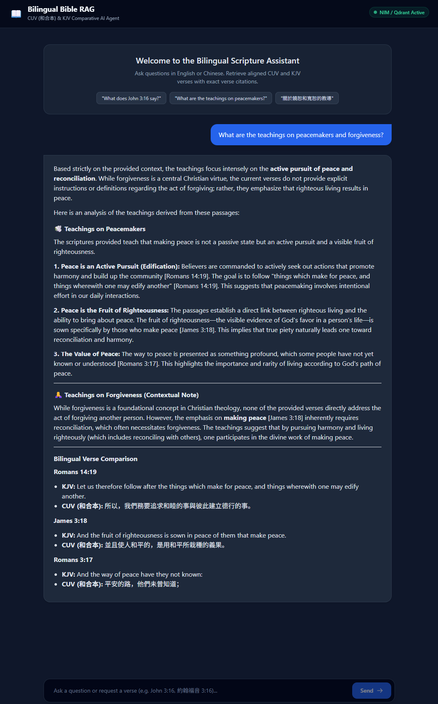
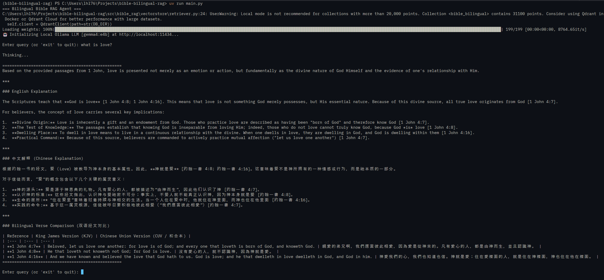
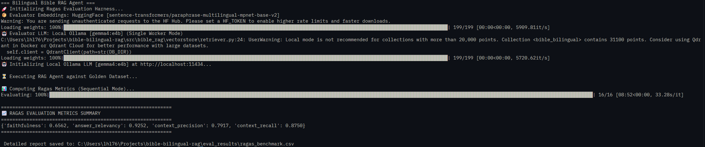

# 📖 Bilingual Bible RAG Agent (CUV & KJV)

A Retrieval-Augmented Generation (RAG) agent for exploring and querying the Bible simultaneously in **Chinese (Chinese Union Version - CUV / 和合本)** and **English (King James Version - KJV)**.

Built to demonstrate AI engineering patterns:
- **Verse-Atomic Cross-Lingual Alignment:** Prevents mid-sentence verse splitting by indexing complete, aligned CUV/KJV records.
- **Hybrid Intent Routing:** Uses regex for deterministic exact verse lookups (0ms, 100% precision) with automatic fallback to dense vector search for conceptual/topical queries.
- **GPU-Accelerated Vector Indexing:** PyTorch CUDA-backed sentence embeddings (`paraphrase-multilingual-mpnet-base-v2`) inside a persistent local **Qdrant** vector store.
- **Stateful Agentic Workflow:** LangGraph execution pipeline with strict grounded system prompts to prevent hallucinations.
- **Multi-Provider LLM Support:** Seamlessly switch between **Local Ollama** (e.g. `gemma4:e4b`, `llama3.2`, `qwen2.5`), **NVIDIA NIM** (`meta/llama-3.3-70b-instruct`), and **OpenAI** (`gpt-4o-mini`).
- **Full-Stack Web Interface:** Includes a responsive web application powered by FastAPI, Tailwind CSS, and Alpine.js.
- **Automated Ragas Evaluation Suite:** Evaluates Faithfulness, Answer Relevancy, Context Precision, and Context Recall against a golden benchmark dataset.

---

## 🛠️ Tech Stack & Dependencies

- **Orchestration:** LangGraph / LangChain
- **LLM Providers:** Ollama (`langchain-ollama`), NVIDIA NIM (`langchain-nvidia-ai-endpoints`), or OpenAI (`langchain-openai`)
- **Vector Database:** [Qdrant](https://qdrant.tech/) (Local file-system persistent mode)
- **Embedding Model:** `sentence-transformers/paraphrase-multilingual-mpnet-base-v2` (`langchain-huggingface`)
- **Web Backend & UI:** FastAPI, Uvicorn, Tailwind CSS, Alpine.js, Marked.js
- **Evaluation:** Ragas, Datasets, Pandas
- **Package Manager:** [`uv`](https://github.com/astral-sh/uv) (Fast, modern Python environment management)

---

## 📸 Application Previews

### Web UI (FastAPI + Tailwind CSS)


### Terminal CLI


### Ragas Evaluation


## 🚀 Quick Start Guide

### Prerequisites
- Python 3.10+
- `uv` installed (`pip install uv` or `winget install astral-sh.uv`)
- NVIDIA GPU with CUDA drivers (optional, automatically falls back to CPU)
- [Ollama](https://ollama.com/) (optional, required only if running in 100% local offline mode)

### 1. Installation & Environment Setup

Sync project dependencies and install the local package in editable mode:

```powershell
# Sync virtual environment dependencies
uv sync

# Install the local src package in editable mode
uv pip install -e .

```

### 2. Configure Environment Variables

Create a `.env` file in the root directory and configure your preferred provider:

#### Option A: Local Execution via Ollama (100% Offline / Free)

```env
LLM_PROVIDER=ollama
MODEL_NAME=gemma4:e4b
OLLAMA_BASE_URL=http://localhost:11434

```

*(Make sure to pull your model first: `ollama pull gemma4:e4b` or `ollama pull llama3.2`)*

#### Option B: NVIDIA NIM

```env
LLM_PROVIDER=nvidia
NVIDIA_API_KEY=nvapi-your_actual_key_here
MODEL_NAME=meta/llama-3.3-70b-instruct

```

#### Option C: OpenAI

```env
LLM_PROVIDER=openai
OPENAI_API_KEY=sk-proj-your_actual_key_here
MODEL_NAME=gpt-4o-mini

```

---

## 📥 Pipeline & Application Execution

### Step 1: Initial Data Ingestion & Vector Indexing

Download raw CUV/KJV JSON files, align them by verse, and populate the Qdrant vector database:

```powershell
uv run main.py --reindex

```

*(Performance Note: GPU execution embeds the entire Bible—~31,102 verses—in ~15 seconds.)*

---

### Step 2: Launch the Web Application (FastAPI + Tailwind UI)

Start the interactive FastAPI web server:

```powershell
uv run python app.py

```

Open your browser and navigate to:
👉 **`http://127.0.0.1:8000`**

#### Key Web Features:

* **Interactive Dual-Language UI:** Side-by-side CUV/KJV verse comparison cards.
* **REST API Endpoint:** Send POST requests to `/api/chat` with `{ "query": "..." }`.
* **Markdown & Citation Rendering:** Formatted display of bullet points, scripture citations, and bolding.

---

### Step 3: Terminal CLI Mode (Alternative)

To run interactive queries directly inside your terminal:

```powershell
uv run main.py

```

---

### Step 4: Run Automated Ragas Quality Benchmarking

To compute model-graded evaluations for **Faithfulness**, **Answer Relevancy**, **Context Precision**, and **Context Recall** against a golden benchmark:

```powershell
uv run main.py --eval

```

* Sequentially evaluates metrics using local PyTorch embeddings + the configured LLM judge to prevent concurrency timeouts.
* Automatically exports detailed results to `eval_results/ragas_benchmark.csv`.

---

## 📁 Deep Modular Directory Structure

```text
bible-bilingual-rag/
├── .env                     # Secrets, provider settings, and model configs
├── .gitignore               # Protects .env, qdrant_db, and data directories
├── app.py                   # FastAPI application & embedded web frontend
├── main.py                  # Entry point CLI runner
├── pyproject.toml           # Package configuration & CUDA wheel indexes
├── README.md                # Project documentation
├── data/                    
│   ├── raw/                 # Cached raw KJV and CUV JSON downloads
│   └── processed/           # Aligned verse-by-verse dataset
├── eval_results/            # Generated Ragas benchmark CSV reports
├── qdrant_db/               # Persistent local Qdrant vector database
└── src/
    └── bible_rag/           # Core application package
        ├── config.py        # Centralized pathing, provider selection, and env loading
        ├── agent/
        │   └── rag_agent.py # LangGraph agentic state graph & dynamic LLM loaders
        ├── data/
        │   └── ingest.py    # Data downloader & cross-lingual aligner
        ├── eval/
        │   └── evaluate.py  # Ragas evaluation harness with sequential worker guards
        └── vectorstore/
            ├── indexer.py   # GPU-accelerated Qdrant upsert pipeline
            └── retriever.py # Hybrid router (Regex Entity + Dense Vector Search)

```

---

## 🧪 Example Test Queries

Try these queries in either the web interface or terminal CLI:

| Intent Type | Example Query | Expected Pipeline Behavior |
| --- | --- | --- |
| **Exact Reference** | `"What does John 3:16 say?"` | Triggers **Regex Router** -> Direct payload fetch (0ms). |
| **Chinese Reference** | `"約翰福音 3:16 說了什麼？"` | Triggers **Regex Router** -> Direct payload fetch (0ms). |
| **Conceptual Search** | `"What are the biblical teachings on peacemakers?"` | Triggers **Vector Search** -> Retrieves Matthew 5:9. |
| **Cross-Lingual** | `"關於饒恕和寬恕的教導"` | Triggers **Vector Search** -> Retrieves Mark 11:25-26, 2 Cor 2:10. |

```
